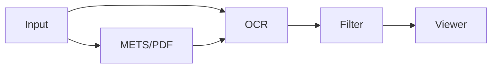

# DeepSeek-OCR Evaluation Framework

> AI-powered OCR Pipeline für gedruckte Dokumente mit METS-Metadaten-Support

---

## 🚀 Quick Navigation

- [[01-Quick-Start]] - Installation & Usage
- [[02-Architecture]] - System-Architektur
- [[03-Results]] - Ergebnisse & Statistiken
- [[04-Learnings]] - Key Insights & Best Practices

---

## 📊 Project Status

| Component | Status | Details |
|-----------|--------|---------|
| **Model** | ✅ Ready | DeepSeek-OCR (3B params, 6.7 GB) |
| **Hardware** | ✅ Ready | RTX 4080, 16 GB VRAM, CUDA 13.0 |
| **METS Processing** | ✅ Done | o:szd.151 (DE, 3p), o:szd.196 (FR, 9p) |
| **PDF Processing** | 🔄 Running | DTS_Flechte.pdf (595 pages) |
| **Viewer** | ✅ Live | [GitHub Pages](https://chpollin.github.io/deepseek-ocr/) |
| **Docs** | ✅ Done | This vault |

---

## 🎯 Core Features



### Input Formats
- **METS** - Digital archive format (XML metadata)
- **PDF** - Direct PDF processing (595 pages tested)
- **Images** - PNG, JPG (300 DPI recommended)

### Processing
- **OCR** - DeepSeek-OCR model (BF16 precision)
- **Artifact Filtering** - Remove color references, scales
- **Statistics** - CER, time, character counts

### Output
- **Interactive Viewer** - Side-by-side comparison
- **Transcriptions** - Complete text files
- **Reports** - Statistics & metrics (Markdown)
- **Samples** - GitHub Pages deployment (5-10 pages)

---

## 📁 Repository Structure

```
deepseek-ocr/
├── docs/                      # 📚 This Obsidian Vault
├── samples/                   # 🎨 GitHub Pages samples
│   ├── images/               # Sample images (12 total)
│   ├── *_sample.json        # Viewer data
│   ├── *_full.json          # Complete data
│   ├── *_transcription.txt  # Full text
│   └── *_report.md          # Statistics
├── data/                     # 📂 Input documents
│   ├── o_szd.151/           # METS document (DE, 3p)
│   ├── o_szd.196/           # METS document (FR, 9p)
│   └── DTS_Flechte.pdf      # PDF (595 pages)
├── results/                  # 💾 OCR outputs
│   ├── mets_*/              # METS results
│   └── pdf_*/               # PDF results
├── index.html               # 🌐 Interactive viewer
├── test_ocr_mets.py         # METS processor
├── test_ocr_pdf.py          # PDF processor
├── filter_artifacts.py      # Artifact filter
├── create_samples.py        # Sample generator
└── generate_viewer_simple.py # Viewer generator
```

---

## 🔗 Quick Links

### External
- **GitHub Repo:** https://github.com/chpollin/deepseek-ocr
- **Live Viewer:** https://chpollin.github.io/deepseek-ocr/
- **Model:** https://huggingface.co/deepseek-ai/DeepSeek-OCR

### Internal Docs
- **Setup Guide:** [[01-Quick-Start#Installation]]
- **Usage Examples:** [[01-Quick-Start#Usage]]
- **Architecture:** [[02-Architecture]]
- **Performance:** [[03-Results#Performance]]
- **Lessons Learned:** [[04-Learnings]]

---

## 📈 Key Metrics

| Metric | o:szd.151 (DE) | o:szd.196 (FR) |
|--------|----------------|----------------|
| **Pages** | 3 | 9 |
| **Language** | German | French |
| **CER** | ~2-3% | N/A |
| **Avg Time/Page** | ~18s | ~18s |
| **Artifacts Filtered** | 47-99% | ~10-20% |

---

## 🏷️ Tags

#ocr #deepseek #mets #pdf #evaluation #machine-learning #pytorch #cuda

---

**Last Updated:** 2025-10-27
**Maintainer:** Research Team
**License:** Research Use
