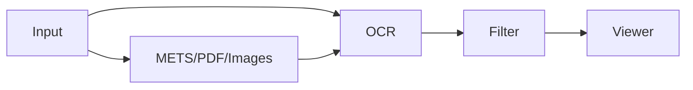

# DeepSeek-OCR Evaluation Framework

> AI-powered OCR Pipeline für gedruckte Dokumente mit METS-Metadaten-Support

---

## 🚀 Quick Navigation

- [[01-Quick-Start]] - Installation & Usage
- [[02-Architecture]] - System-Architektur
- [[03-Results]] - Ergebnisse & Statistiken (6 Dokumente, 22 Seiten)
- [[04-Learnings]] - Key Insights & Best Practices
- [[05-OCR-Optimization]] - Parameter Tuning & Experimente

---

## 📊 Project Status

| Component | Status | Details |
|-----------|--------|---------|
| **Model** | ✅ Ready | DeepSeek-OCR (3B params, 6.7 GB, BF16) |
| **Hardware** | ✅ Ready | RTX 4080, 16 GB VRAM, CUDA 13.0 |
| **METS Processing** | ✅ Done | o_szd.151 (DE, 3p), o_szd.196 (FR, 9p) |
| **Image Processing** | ✅ Done | HSA (FR, 1p), karteikarten (Multi, 6p) |
| **PDF Processing** | ⚠️ Partial | DTS_Flechte (2/20 pages, memory issues) |
| **Viewer** | ✅ Live | [GitHub Pages](https://chpollin.github.io/deepseek-ocr/) |
| **Samples** | ✅ Done | 6 documents, 22 pages, 50,590 characters |
| **Docs** | ✅ Done | This knowledge base |

---

## 🎯 Core Features



### Input Formats
- **METS** - Digital archive format (XML metadata) - 2 docs
- **PDF** - Direct PDF processing (partial success) - 1 doc
- **Images** - PNG/JPG, single or multi-image collections - 3 docs
  - Single images with ground-truth evaluation
  - Multi-image collections (karteikarten: 6 cards)

### Processing
- **OCR** - DeepSeek-OCR model (BF16 precision, 3B params)
- **Artifact Filtering** - Remove color references, scales, noise
- **Statistics** - CER, WER, time, character counts
- **Ground-Truth Evaluation** - Compare with reference transcriptions

### Output
- **Interactive Viewer** - Side-by-side comparison
- **Transcriptions** - Complete text files
- **Reports** - Statistics & metrics (Markdown)
- **Samples** - GitHub Pages deployment (6 documents)

---

## 📁 Repository Structure

```
deepseek-ocr/
├── knowledge/                 # 📚 This Documentation
│   ├── 00-Index.md           # Overview (you are here)
│   ├── 01-Quick-Start.md     # Installation & Usage
│   ├── 02-Architecture.md    # System Design
│   ├── 03-Results.md         # All 6 samples documented
│   ├── 04-Learnings.md       # Insights & Best Practices
│   ├── 05-OCR-Optimization.md # Parameter tuning experiments
│   └── JOURNAL.md            # Development journal
├── docs/                      # 🌐 GitHub Pages Website
│   ├── index.html            # Interactive viewer
│   └── samples/images/       # 22+ sample images
│       ├── o_szd.151/        # German letter (3 images)
│       ├── o_szd.196/        # French speech (9 images)
│       ├── o_hsa_letter_2261/ # French Nobel Prize letter (1 image)
│       ├── o_anno_grazer_tagblatt/ # German newspaper (1 image)
│       ├── o_DTS_Flechte_20pages/ # Botanical text (2 images)
│       └── o_karteikarten/    # Archive cards (6 images)
├── samples/                   # 📂 Sample Data (for viewer)
│   ├── images/               # Source images
│   ├── samples.json          # Master sample list (6 docs)
│   ├── *_sample.json         # Viewer data
│   ├── *_full.json           # Complete data
│   ├── *_transcription.txt   # Full text
│   └── *_report.md           # Statistics
├── data/                      # 📥 Input Documents
│   ├── o_szd.151/            # METS document (DE, 3p)
│   ├── o_szd.196/            # METS document (FR, 9p)
│   ├── o_hsa_letter_2261/    # Single image + ground-truth
│   ├── anno/                 # Historical newspaper
│   ├── DTS_Flechte_20pages.pdf # PDF (20 pages)
│   └── karteikarten/         # 6 archive cards
├── results/                   # 💾 OCR Outputs
│   ├── mets_*/               # METS results
│   ├── pdf_*/                # PDF results
│   └── image_*/              # Single-image results
├── scripts/                   # 🔧 Processing Scripts
│   ├── test_ocr_mets.py      # METS processor
│   ├── test_ocr_pdf.py       # PDF processor
│   ├── test_ocr_image.py     # Single-image processor
│   ├── filter_artifacts.py   # Artifact filter
│   ├── create_samples.py     # METS sample generator
│   ├── create_sample_from_image.py # Single-image sample
│   ├── create_multi_image_sample.py # Multi-image collection
│   ├── create_dts_sample.py  # DTS-specific sample
│   └── generate_viewer_simple.py # Viewer generator
├── requirements.txt           # Python dependencies
└── README.md                  # Project README
```

---

## 🔗 Quick Links

### External
- **GitHub Repo:** https://github.com/chpollin/deepseek-ocr
- **Live Viewer:** https://chpollin.github.io/deepseek-ocr/
- **Model:** https://huggingface.co/deepseek-ai/DeepSeek-OCR
- **Model GitHub:** https://github.com/deepseek-ai/DeepSeek-OCR

### Internal Docs
- **Setup Guide:** [[01-Quick-Start#Installation]]
- **Usage Examples:** [[01-Quick-Start#Usage]]
- **Architecture:** [[02-Architecture]]
- **All Samples:** [[03-Results#Sample Overview]]
- **Performance:** [[03-Results#Performance Metrics]]
- **Lessons Learned:** [[04-Learnings]]
- **Optimization:** [[05-OCR-Optimization]]

---

## 📊 Processing Statistics

| Metric | Value |
|--------|-------|
| **Documents Processed** | 6 |
| **Pages Successful** | 22 |
| **Total Characters** | 50,590 |
| **Languages** | DE, FR, EN, IT |
| **Avg Speed** | 6-25s/page (content-dependent) |
| **VRAM Usage** | ~10 GB |

### Document Types Tested

- ✅ **METS Archives:** 2 documents (12 pages)
- ✅ **Single Images:** 2 documents (2 pages)
- ⚠️ **Multi-Image Collections:** 1 document (6 cards, 5/6 successful)
- ⚠️ **PDF:** 1 document (2/20 pages successful)
- ❌ **Historical Newspapers:** 1 document (failed, repetition bug)

---

## 🔬 Key Findings

### ✅ Success Stories
1. **o_szd.151 (German):** 97-98% accuracy, excellent artifact filtering
2. **o_szd.196 (French):** Consistent quality, 200 pages/hour throughput
3. **o_hsa_letter_2261 (French):** First ground-truth evaluation (CER 21.87%)
4. **karteikarten (Multi-language):** 5/6 cards successful, IT/EN/DE support

### ❌ Failures
1. **anno_grazer_tagblatt:** Repetition bug on Fraktur newspaper
2. **DTS_Flechte PDF:** 90% pages failed (memory issues, large PDF)
3. **karteikarten Card 1:** Italian form with repetition bug

### 🎯 Best Use Cases
- Modern typed documents (letters, forms)
- Multi-language archives (DE/FR/EN/IT)
- Scientific publications (citations, formulas)
- Ground-truth evaluation projects

### 🚫 NOT Recommended
- Historical newspapers (Fraktur script)
- Large PDF batches (>20 pages)
- Complex multi-column layouts
- Time-critical bulk processing

---

## 🛠️ Available Workflows

### 1. METS Processing
```bash
python scripts/test_ocr_mets.py data/o_szd.151
```
- Input: METS XML + images
- Output: Full OCR with metadata
- Best for: Digital archives

### 2. Single-Image OCR
```bash
python scripts/test_ocr_image.py data/image.jpg --ground-truth transcription.txt
```
- Input: Single JPG/PNG
- Output: OCR + optional CER/WER evaluation
- Best for: Individual documents, quality testing

### 3. Multi-Image Collection
```bash
python scripts/create_multi_image_sample.py doc_id "Title" --language multi \
  results/image_1/ results/image_2/ results/image_3/
```
- Input: Multiple OCR results
- Output: Combined sample for viewer
- Best for: Document collections (karteikarten)

### 4. PDF Processing
```bash
python scripts/test_ocr_pdf.py data/document.pdf
```
- Input: PDF file
- Output: Page-by-page OCR
- Best for: Small PDFs (<20 pages)

---

## 🎨 Sample Viewer Features

**Live at:** https://chpollin.github.io/deepseek-ocr/

- 📄 **6 Documents:** Browse all processed samples
- 🖼️ **22 Pages:** Side-by-side image/text comparison
- 📊 **Statistics:** Processing time, character counts, CER/WER
- 🌍 **Multi-language:** DE, FR, EN, IT support
- 📱 **Responsive:** Works on desktop & mobile
- 🔍 **Search:** Filter documents by language/status

---

## 📈 Performance Benchmarks

| Content Type | Speed | Success Rate |
|--------------|-------|--------------|
| **Simple Forms (EN)** | 6-10s/page | 100% |
| **Typed Letters (DE/FR)** | 15-20s/page | 100% |
| **Scientific Text** | 20-30s/page | 100% (when successful) |
| **Historical Newspapers** | 280s+/page | 0% (repetition bug) |
| **Multi-language Cards** | 9s/page avg | 83% (5/6) |

---

## 🔄 Latest Updates

### 2025-10-29
- ✅ Added karteikarten multi-image sample (6 cards, IT/EN/DE)
- ✅ Created `create_multi_image_sample.py` script
- ✅ Fixed missing text fields in samples.json
- ✅ Updated viewer subtitle with model information
- ✅ Documented all 6 samples in [[03-Results]]

### 2025-10-28
- ✅ Added HSA letter with ground-truth evaluation (CER 21.87%)
- ✅ Added ANNO newspaper (failed, repetition bug)
- ✅ Added DTS Flechte partial sample (2/20 pages)
- ✅ Documented OCR optimization experiments in [[05-OCR-Optimization]]

### 2025-10-27
- ✅ Initial METS processing (o_szd.151, o_szd.196)
- ✅ Created interactive viewer
- ✅ Deployed to GitHub Pages

---

## 🎯 Next Steps

### Potential Improvements
- [ ] Batch processing for large document collections
- [ ] Better PDF preprocessing (page-by-page extraction)
- [ ] Post-processing rules (Eszett correction, bracket removal)
- [ ] Repetition bug detection & mitigation
- [ ] Tesseract comparison on same documents

### Future Experiments
- [ ] Test on handwriting (expected to fail)
- [ ] Compare different model sizes
- [ ] Optimize for specific document types
- [ ] Automated ground-truth alignment

---

## 🏷️ Tags

#ocr #deepseek #mets #pdf #evaluation #machine-learning #pytorch #cuda #ground-truth #multi-language

---

**Last Updated:** 2025-10-29
**Maintainer:** Research Team
**License:** Research Use

---

**See also:** [[01-Quick-Start]] | [[02-Architecture]] | [[03-Results]] | [[04-Learnings]] | [[05-OCR-Optimization]]
